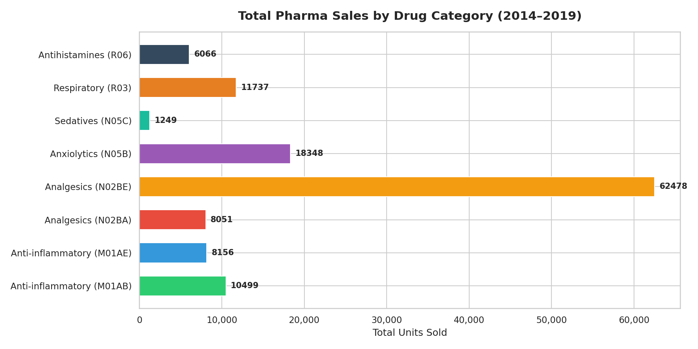
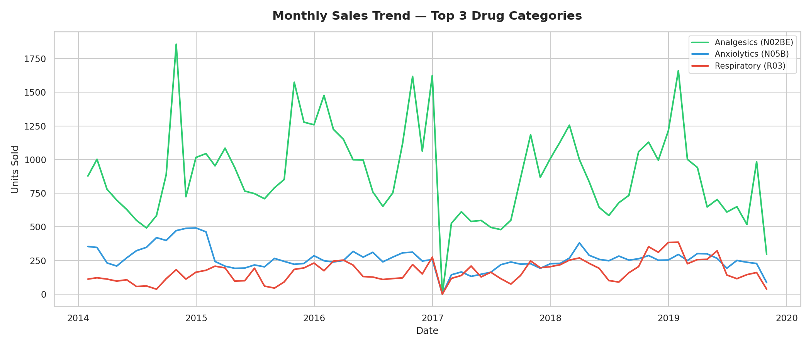
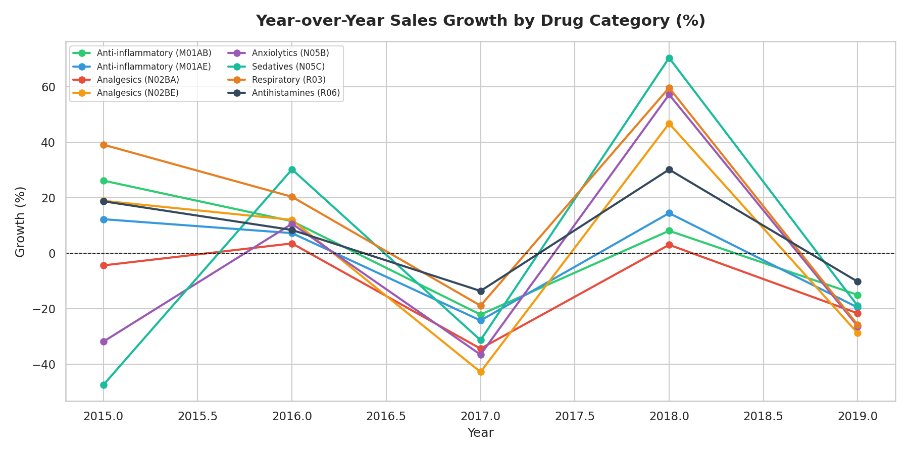
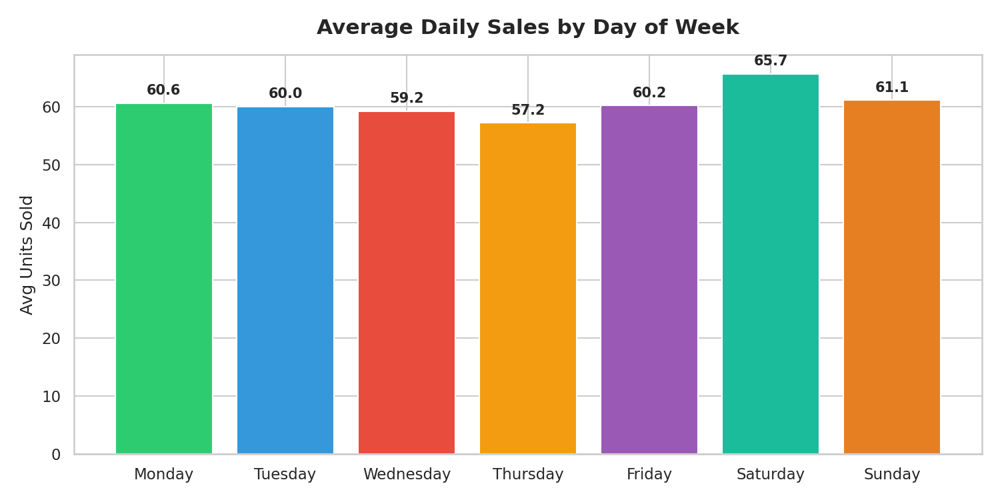
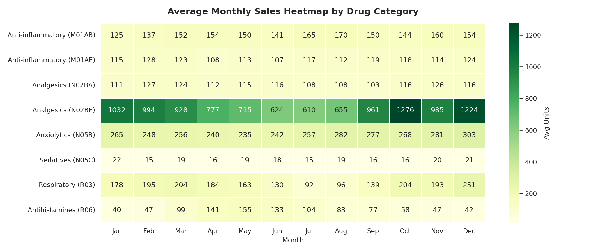

# 💊 Pharmaceutical Sales Analysis (2014–2019)

> A comprehensive data analysis of 6-year pharmaceutical sales across 8 drug categories — built with Python.

---

## 📌 Project Overview

This project analyzes real-world pharmaceutical sales data from a European pharmacy chain spanning 6 years (2014–2019). The goal is to uncover sales trends, seasonal patterns, and year-over-year growth across 8 ATC-classified drug categories — the kind of insights that drive commercial decisions in the pharma industry.

---

## 🎯 Business Questions Answered

- Which drug categories generate the highest sales volume?
- How have sales trended month-over-month over 6 years?
- Which drug categories are growing vs. declining year-over-year?
- What is the best-performing day of the week for sales?
- Are there seasonal patterns that can inform forecasting and stock planning?

---

## 📊 Key Findings

- **Analgesics (N02BE)** dominate total sales — accounting for the largest share across all years
- **Anti-inflammatory drugs** show consistent seasonal spikes in winter months (Nov–Jan)
- **Sedatives (N05C)** recorded the most volatile year-over-year growth
- **Saturday** is the highest average sales day, suggesting weekend demand patterns worth targeting
- Clear seasonal heatmap patterns suggest opportunities for demand forecasting and inventory optimization

---

## 🗂️ Dataset

| File | Description |
|---|---|
| `salesdaily.csv` | Daily sales per drug category |
| `salesweekly.csv` | Weekly aggregated sales |
| `salesmonthly.csv` | Monthly aggregated sales |
| `saleshourly.csv` | Hourly sales breakdown |

**Source:** [Kaggle — Pharma Sales Data](https://www.kaggle.com/datasets/milanzdravkovic/pharma-sales-data)

**Drug Categories (ATC Classification):**

| Code | Category |
|---|---|
| M01AB | Anti-inflammatory |
| M01AE | Anti-inflammatory |
| N02BA | Analgesics |
| N02BE | Analgesics |
| N05B | Anxiolytics |
| N05C | Sedatives |
| R03 | Respiratory |
| R06 | Antihistamines |

---

## 📈 Visualizations

### 1. Total Sales by Drug Category


### 2. Monthly Sales Trend — Top 3 Drug Categories


### 3. Year-over-Year Growth (%)


### 4. Average Sales by Day of Week


### 5. Monthly Sales Heatmap


---

## 🛠️ Tools & Libraries

- **Python 3**
- **Pandas** — data loading, cleaning, aggregation
- **Matplotlib** — custom visualizations
- **Seaborn** — heatmap and statistical plots

---

## 🚀 How to Run

```bash
# 1. Clone the repository
git clone https://github.com/AntoineWagdi/pharma-sales-analysis.git

# 2. Install dependencies
pip install pandas matplotlib seaborn

# 3. Run the analysis
python pharma_sales_analysis.py
```

---

## 💼 About the Author

**Antoine Wagdi** — Pharma Commercial Consultant & Data Analyst with 13+ years of experience across the Gulf and MENA region. Specialized in turning pharma and healthcare data into actionable commercial insights.

🔗 [Upwork Profile](#) | 📧 antoinewagdi@gmail.com | 🌍 Dubai, UAE

---

*This project is part of a pharma & healthcare data analysis portfolio targeting commercial insights for the Gulf/MENA market.*
